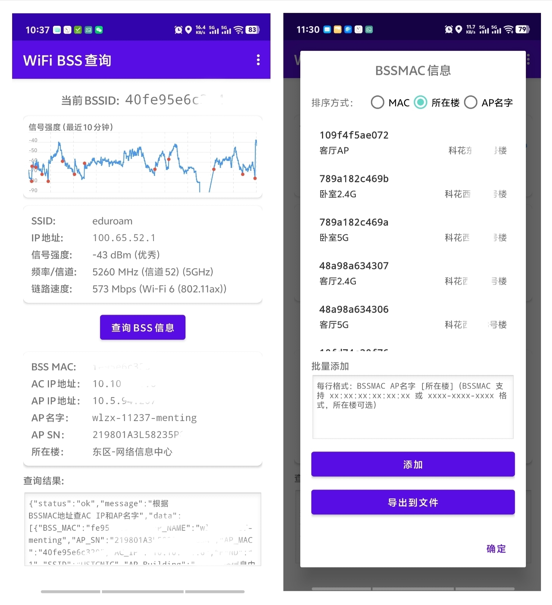

# WiFi BSS 查询

USTC 校园网 WiFi 信息查询工具。获取当前连接的 WiFi 详细信息，并查询 AP 设备信息。

可以添加 BSSMAC、AP 名字、楼信息，适合在小规模 WiFi 网络使用，观察信号和漫游情况。



## 功能

- **WiFi 信息显示**：SSID、BSSID、IP 地址、信号强度（RSSI 及等级）、频率/信道/频段、链路速度及 WiFi 标准（Wi-Fi 4/5/6/7）
- **RSSI 信号强度图表**：显示最近 10 分钟的信号强度变化曲线，BSSID 切换时有红色标记
- **BSS 信息查询**：通过 API 查询 AP 的 AC_IP、AP_IP、AP_NAME、AP_SN、AP_Building 等信息
- **本地 BSSMAC 数据库**：手动编辑和批量添加 BSSMAC 信息（设置 → BSSMAC 信息），查询时优先使用本地数据
- **本地数据排序**：支持按 MAC、所在楼、AP 名字排序
- **本地数据导出**：将 BSSMAC 数据库导出为文本文件
- **查询历史记录**：自动记录 BSSID 变化历史，支持滑动删除和保存到本地数据库
- **自动查询**：BSSID 变化时自动查询（优先本地数据，失败自动重试 3 次）
- **自动刷新**：可设置 1s/5s/10s 间隔自动刷新 WiFi 信息
- **版本更新检查**：启动时自动检查新版本，提示下载更新
- **可配置查询 API**：支持自定义查询 URL 和 Authorization Bearer Key

## 技术栈

- **语言**: Kotlin
- **最低 SDK**: Android 10 (API 29)
- **目标 SDK**: Android 14 (API 34)
- **网络库**: OkHttp 4.11.0
- **异步**: Kotlin Coroutines
- **UI**: ViewBinding + Material Design

## 权限说明

- `ACCESS_WIFI_STATE` — 获取 WiFi 状态
- `ACCESS_FINE_LOCATION` / `ACCESS_COARSE_LOCATION` — Android 10+ 获取 BSSID 需要位置权限
- `NEARBY_WIFI_DEVICES` — Android 13+ 需要此权限以扫描附近 WiFi 设备
- `INTERNET` — 访问 API

权限不足时应用会弹出详细说明对话框，解释为什么需要各项权限。

## 使用方法

1. 在 Android Studio 中打开项目
2. 编译并运行到设备或模拟器
3. 授予位置权限（Android 10-12）或近场设备权限（Android 13+）
4. 连接 WiFi 后点击「查询 BSS 信息」或开启自动查询

## 测试

测试 BSSID：`bcd0eb0c6691`

API 端点：`https://linux.ustc.edu.cn/api/bssinfo.php?bssid={bssid}`

## 工作原理

为方便了解园区 WiFi 的使用状态，安卓手机可以运行本程序获取连接的 WiFi BSS 信息，并将 BSS 的 MAC 地址（去掉中间的 `-`、`:` 字符）通过参数 `bssid=XXXXXXXXXXX` 发送给配置的查询 URL。如果设置了查询 KEY，放在 HTTP 请求头 `Authorization: Bearer` 后送给查询 URL。

查询 URL 可以选择性返回如下 JSON，APP 会显示这些信息方便了解 WiFi 工作状态：

```json
{
  "status": "ok",
  "data": [{
    "BSS_MAC": "19c97ad55e00",
    "AP_NAME": "wlzx-13895-207",
    "AP_SN": "219801A6M28257E00XXX",
    "AP_MAC": "19c97ad55e00",
    "AC_IP": "x.x.x.x",
    "BAND": "2",
    "SSID": "ssid",
    "AP_Building": "东区 - 网络信息中心",
    "AP_IP": "x.x.x.x"
  }]
}
```

## 构建

```bash
./gradlew assembleRelease    # 构建 Release APK（签名，默认）
./gradlew assembleDebug      # 构建 Debug APK
```

构建产物：`app/build/outputs/apk/release/app-release.apk`

## 查询 API

api/ 目录下有通用的 API 查询服务端（server.py），支持任意 AC 厂商的数据。
api/h3c 和 api/huawei 目录下分别有对应厂商的数据采集和处理脚本。


## 更新历史

### v1.29
- 新增：同 SSID 附近其他 AP 的 RSSI 信号曲线显示（2 个最强 AP）
- 新增：自动查询附近 AP 名称并在图表下方显示
- 新增：设置中增加缓存 AP 信息选项，减少查询次数
- 优化：图表布局和底部文字显示

### v1.28
- 显示文字优化：关于页面描述文本优化，表达更清晰流畅
- 设置项文字调整：BSSID 变化时自动查询
- 作者信息格式简化
- 更新日志精简

### v1.27
- 构建系统升级：AGP 8.5.2 + Kotlin 2.0.0 + Gradle 8.7 + Java 17

### v1.26
- BSSMAC 编辑优化：修改 MAC 地址时保留原记录并添加新记录
- 移除未使用的代码

### v1.25
- 关于页面增加本地 BSSMAC 数据库功能说明
- 添加 GitHub 仓库链接
- 菜单顺序调整，关于移至最上方

### v1.24
- 修复本地 BSSMAC 数据未更新历史记录的问题

### v1.23
- BSSMAC 支持按 MAC/所在楼/AP 名字排序
- BSSMAC 批量添加时所在楼可选
- BSSMAC 信息支持导出到文件
- WiFi 标准显示支持 Wi-Fi 7 (802.11be)
- 权限不足时显示详细说明，解释为什么需要各项权限

### v1.22
- 移除未使用的 import 和布局元素

### v1.21
- 修复 BSSMAC 信息编辑后列表不刷新的问题

### v1.20
- 恢复位置权限以获取真实 BSSID（Android 10+ 需要）

### v1.19
- 移除 GPS 定位权限要求，仅保留 Android 13+ 近场设备权限
- 添加屏幕唤醒保持，APP 运行时屏幕不会休眠
- 自动查询关闭时也会检查本地数据库
- WiFi 标准显示使用 Android 11+ 官方 API

### v1.18
- WiFi 技术标准显示（WiFi 4/WiFi 5/WiFi 6/WiFi 6E/WiFi 7）

### v1.17
- RSSI 图表时间范围从 5 分钟扩展到 10 分钟
- 添加每分钟一条的竖向虚线网格

### v1.16
- 点击历史记录可保存到本地 BSSMAC 数据库

### v1.15
- 新增本地 BSSMAC 信息编辑功能（设置 → BSSMAC 信息）
- 支持批量添加：每行格式"BSSMAC AP 名字 [所在楼]"
- 支持多种 BSSMAC 格式自动识别（xx:xx:xx:xx:xx:xx、xxxx-xxxx-xxxx 等）
- 查询时优先使用本地数据

### v1.12
- 新增 RSSI 信号强度曲线图，显示最近 5 分钟变化
- BSSID 切换时用红色大圆点标记
- 优化布局：图表置顶，查询结果可滚动

### v1.11
- 新增查询历史记录，保存 BSSID、AP 名字、楼名和查询时间
- BSSID 变化时自动记录，相同 BSSID 智能合并
- 菜单中可查看和清除历史记录

### v1.7
- 修正 5GHz/6GHz 频段判断逻辑（5925MHz 以上为 6GHz）
- 无效频率时不显示频段标识

### v1.6
- 设置中增加自动刷新时间选项（不刷新/1s/5s/10s）
- 按设定间隔自动刷新 WiFi 信息（RSSI、频率/信道等）
- 刷新后 BSSID 变化时触发自动查询（如果已开启）
- 自动查询失败时 1 秒后重试，最多 3 次

### v1.5
- 优化关于对话框内容和布局

### v1.4
- BSSID 居中显示
- BSS 信息使用卡片展示，与 WiFi 信息样式一致

### v1.3
- 关于对话框支持滚动显示
- 分段展示：功能说明、重大更新

### v1.2
- 在查询结果最上方显示返回的 BSS MAC 地址

### v1.1
- 添加右上角菜单（设置、关于）
- 设置可配置查询 URL 和 KEY（Authorization: Bearer）
- WiFi 信息卡片显示：SSID、BSSID、IP 地址、信号强度、频率/信道、链路速度
- 信号强度分级显示（优秀/良好/一般/较差/弱）
- 自动感知 WiFi 连接变化并刷新显示

### v1.0
- 获取当前 WiFi BSSID
- 查询 BSS 信息并显示
